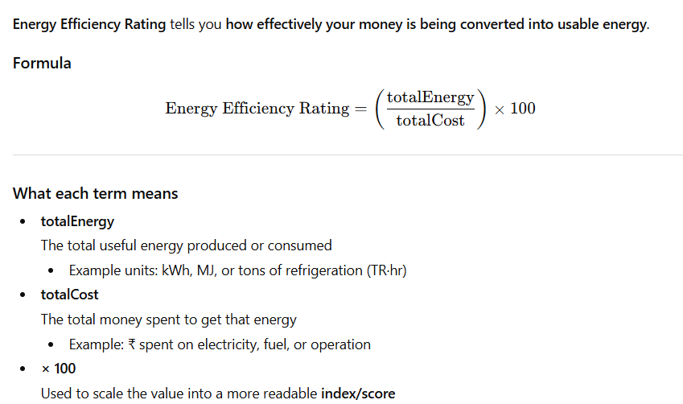
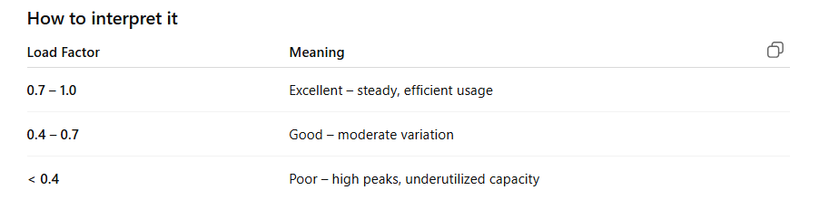

# Analytics Features - Client Explanation Guide

## 📊 Custom Analytics Page

**What It Shows:**
The Custom Analytics page displays advanced energy performance metrics calculated from your real-time meter data. Unlike standard analytics that show basic consumption and cost, this page provides specialized industry-standard calculations such as Energy Efficiency Rating (how much energy you get per rupee spent),  Load Factor (how consistently you use power vs. peak capacity), Diversity Factor (how different devices peak at different times), and Power Quality Index (voltage stability indicator). These metrics are organized into five categories: Performance, Cost, Usage, Quality, and Environment, giving you a complete picture of your facility's energy health.

**The Logic Behind It:**
The system collects raw electrical data from all connected energy meters (power, voltage, current, energy consumption) and applies mathematical formulas to derive meaningful business insights. For example, the Energy Efficiency formula divides total energy by total cost to show kWh per ₹100 spent - a higher number means better value. The Load Factor compares your average power usage to your maximum demand to identify underutilized capacity. All calculations update in real-time and can be viewed for different periods (today, this week, this month). The framework is extensible - you can add custom formulas by editing a simple JSON configuration file, making it adaptable to your specific industry KPIs without requiring code changes.

---

## 🔮 Predictive Analytics Page

**What It Shows:**
The Predictive Analytics page uses artificial intelligence to forecast future energy consumption and identify patterns that could save you money. It displays four key insights: (1) **Demand Forecasting** - predictions of your power consumption for the next hour, next 24 hours, and next 7 days with confidence intervals, including when your peak demand will occur; (2) **Trend Analysis** - whether your energy, power, or costs are increasing, decreasing, or stable over daily/weekly/monthly periods; (3) **Anomaly Detection** - alerts when actual consumption significantly differs from expected patterns, indicating potential equipment issues or wastage; and (4) **AI Recommendations** - actionable suggestions like shifting loads from peak to off-peak hours, improving power factor, or reducing demand during high-tariff periods, with estimated savings for each action.

**The Logic Behind It:**
The system analyzes 7 days of historical meter readings (collected every 15 minutes) to understand your facility's energy patterns. It uses exponential smoothing algorithms - a proven statistical technique - to predict future consumption by weighing recent data more heavily than older data while accounting for daily and weekly patterns (weekdays vs. weekends, business hours vs. night). For anomaly detection, it calculates expected values based on historical averages and flags deviations beyond normal ranges with severity levels (low/medium/high/critical). The recommendation engine identifies inefficiencies by comparing hourly usage patterns - for instance, if your peak hour consumption is 50% higher than off-peak, it suggests load shifting opportunities. All predictions include confidence intervals (typically 85%) showing the likely upper and lower bounds, helping you make informed decisions about capacity planning and energy procurement.

---

## 🎯 Business Value Summary

**Custom Analytics** answers: "How efficiently am I using energy right now?" with actionable metrics that benchmark your performance and identify immediate improvement areas using industry-standard calculations.

**Predictive Analytics** answers: "What will happen next, and how can I prevent problems?" by forecasting future demand, detecting unusual patterns early, and providing specific recommendations to reduce costs and optimize operations.

Both pages work together to give you complete visibility: Custom Analytics shows your current state with precision, while Predictive Analytics helps you plan ahead and avoid surprises. The data-driven approach ensures every insight is backed by actual meter readings, not assumptions, making your energy management decisions more confident and cost-effective.
